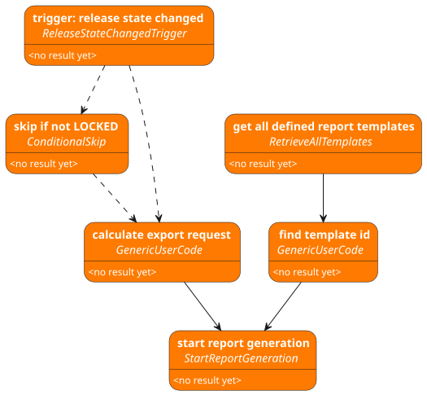

# Welcome to the flow.kit documentation

## Table of contents

<!-- TOC -->
* [Concept](#concept)
* [Bundle-content](#bundle-content)
  * [flow_definition.py](#flow_definitionpy)
    * [How to use .add_block_with()](#how-to-use-add_block_with)
      * [Example code](#example-code)
  * [main.py](#mainpy)
  * [flow_kit](#flow_kit)
    * [core](#core)
    * [library](#library)
    * [tools](#tools)
  * [interpreter](#interpreter)
  * [site-packages](#site-packages)
  * [examples](#examples)
* [Sample flow](#sample-flow)
* [test.guide blocks](#testguide-blocks)
* [User specific blocks](#user-specific-blocks)
* [Instructions for integrating the flow in test.guide](#instructions-for-integrating-the-flow-in-testguide)
  * [Initial setup of workflow automation runners](#initial-setup-of-workflow-automation-runners)
  * [Implementation and trigger configuration of a workflow](#implementation-and-trigger-configuration-of-a-workflow)
  * [Navigation in test.guide](#navigation-in-testguide)
  * [Flow tasks](#flow-tasks)
  * [Event filter in flow triggers](#event-filter-in-flow-triggers)
  * [Environment variables](#environment-variables)
* [IDE-setup for flow implementation](#ide-setup-for-flow-implementation)
  * [Visual Studio Code (.vscode)](#visual-studio-code-vscode)
  * [PyCharm (.idea)](#pycharm-idea)
<!-- TOC -->

# Concept

The flow.kit enables test.guide users to define workflow automations in a user-friendly way.
For this purpose, it provides generic flow blocks that implement atomic functions.
These blocks can be parametrized and linked with each other according to the requirements
of the flow to be automated.

Once a flow has been implemented with the flow.kit, it is loaded to test.guide and linked
to an event type. For each occurring event of the linked type a flow task is created,
which runs the flow defined with the flow.kit on one of the test resources of test.guide.
This means that workflow automation with the flow.kit does not require any additional infrastructure
but can be executed directly on the existing test resources/testbenches of test.guide.

# Bundle-content

The flow.kit-bundle is a self-contained zip-file.

The following sections describe the contents of the individual folders.

## flow_definition.py

This file defines a `get_flow()`-function that returns a `flow_kit.Flow` object,
which is the specific flow implementation.

For better usability the `flow_kit.FlowBuilder`
should be used to define the flow. The flow should be defined by adding multiple configured flow blocks
using the `.add_block_with()` method of the FlowBuilder.

``` python
from flow_kit import Flow, FlowBuilder

def get_flow() -> Flow:
    """Define the flow to be executed."""
    return (
        FlowBuilder()
        .add_block_with([.....])
        .add_block_with([.....])
        [.....]
        .build()
```

### How to use .add_block_with()

With the method `.add_block_with(block, *parameter_assignments, required_blocks=, result_alias=)` of a `FlowBuilder`
object a block can be added and fully configured.

- First parameter is the new block itself.
    - It is recommended to use an assignment expression (`:=`) here to store the block in a variable.
      So the block can be used as input or dependency for other blocks.
    - To set a user defined label for the block the method `.with_label(label)` can be used on every block object.

- All other positional parameters are treated as assignments to the block parameters:
    - Three kinds of assignments are available:
        - `Assign(parameter_key).to_static_value(value)` sets a fixed value to the parameter with given parameter_key.
        - `Assign(parameter_key).to_block_result(result_block)` links a result of a block to the parameter with given
          parameter_key.
            - For this, the required block should be saved using assignment expression.
        - `Assign(parameter_key).to_user_expression(expression)` enables the user to define any python expression.
            - The result of all blocks with defined `result_alias` are available as identifier for this expression.
            - Always remember to add the blocks used in expression to required_blocks, to ensure that they are execute
              first.
    - The `parameter_key` should be given as the corresponding constant in the class of the block.

- The keyword parameter `result_alias=` must be set,
  if the result of the block should be used in the python expression inside a `Assign(...).to_user_expression(...)`.

- The keyword parameter `required_blocks=` can be set to define blocks that have to be executes earlier.

#### Example code

```python
from pathlib import PurePath

from flow_kit import (
    Flow,
    FlowBuilder,
    Assign,
)


def get_flow() -> Flow:
    """Define the flow to be executed."""
    return (
        FlowBuilder()

        # Block that will be used in Assign(...).to_block_result(...)
        .add_block_with(
            block_a := BlockA().with_label('Block whose result is used directly.'),
            # variable block_a is needed later to link this block in a Assign(...).to_block_result(...)
            [...],
        )

        # Block that will be used in Assign(...).to_user_expression(...)
        .add_block_with(
            block_b := BlockB().with_label('Block whose result will be adjusted'),
            # variable block_b is needed later to link this block as required
            [...],
            result_alias='block_b_alias',
            # result_alias must be set here, because result of this block will be used 
            # in a Python expression in Assign(...).to_user_expression(...).
        )

        # Block that has 3 parameters to show usage of parameter assignments with Assign.
        .add_block_with(
            BlockC().with_label('Block to show usage of parameter assignments.'),
            Assign(
                BlockC.PAR__A)  # parameter key should be given as the corresponding constant in the class of the block.
            .to_static_value(
                PurePath('C:\\temp')  # value is directly given as python object.
            ),
            Assign(
                BlockC.PAR__B)  # parameter key should be given as the corresponding constant in the class of the block.
            .to_block_result(
                block_a  # block whose result is to be used
            ),
            Assign(
                BlockC.PAR__C)  # parameter key should be given as the corresponding constant in the class of the block.
            .to_user_expression(
                'str(block_b_alias.get_id())'
                # expression as str which may use all defined aliases and python builtins.
            ),
            required_blocks=[
                # block_a,  # this is optional because Assign(...).to_block_result(...) already adds block_a
                block_b,
                # this is mandatory because alias of block_b is used in a Python expression inside an Assign(...).to_user_expression()
            ],
        )
        .build()
    )
```

## main.py

> **WARNING:** This file must not be modified!

This file will be called when executing the defined flow. It accepts 3 arguments:

- `--validate` will perform a static validation of the flow.
- `--execute` will execute the flow.
- **Experimental Feature**: `--visualize` will create a _Workflow.puml_ file in your working
  directory, which contains a graphical representation of the described workflow.

> **NOTE:** For local test runs, it must be ensured that the required environment variables are provided.
> These are `TRIGGER_PAYLOAD`, `TEST_GUIDE_AUTH_KEY`, `TEST_GUIDE_PROJECT_ID`, `TEST_GUIDE_URL`, `TT_RUN_IN_FLOW_AUTOMATION`
> and others that are required by the specific flow.

> **WARNING:** `--visualize` is still under development and does not support all features.

## flow_kit

This directory is a python module, containing the generic implementations of the flow.kit.

> **WARNING:** This directory must not be modified!

### core

This directory contains core functions of the flow blocks and the flow.

### library

This directory contains all blocks that can be used to define the flow.
Refer to [builtin_blocks_documentation.html](builtin_blocks_documentation.html)
for documentation of all blocks.

### tools

This directory contains additional functionality needed by `core` or `library`.

## interpreter

This directory contains a portable python 3.12 interpreter for windows.

## site-packages

This directory contains the python site-packages needed by the generic flow.kit implementation.

## examples

This directory contains example flow definitions with detailed description.

# Sample flow

This bundle is delivered with a sample flow definition:

The automation task is: Start a PDF report generation, whenever a release is locked.
To do this, this flow must be linked to a ReleaseStateChangedEvent in a flow trigger in test.guide.

The following figure shows the structure of the example flow.
Solid links between blocks represent a data flow. Dashed links represent a dependency without data flow.
First line of text in a block is a user-friendly description of what the block does in this flow.
Second line of text in a block is the python class name of the block.



* The first block *(ReleaseStateChangedTrigger)* is a trigger-block,
  that provides the payload of the event that triggered the flow.
* The second block *(ConditionalSkip)* is used to skip all following blocks, if the triggering event is not LOCKED.
* After that the available report templates are retrieved from the test.guide server *(RetrieveAllTemplates)*.
* User defined blocks *(GenericUserCode)* calculate data
  required for final block *(StartReportGeneration)* that starts the PDF export task.

# test.guide blocks

The flow.kit provides a set of blocks for interaction with test.guide. 
The test.guide server, which should be addressed, and authentication key can be customized by using the *TGInit* block.
If no custom configuration is set, the default configuration is used. 
* Default values:
  * test.guide url in ResourceAdapter configuration
  * test.guide project id in ResourceAdapter configuration
  * test.guide authentication key of flow trigger user

# User specific blocks

For complex logic or special services that are not provided by the BuiltIn blocks,
user code blocks can be implemented.
For this purpose, the `flow_kit.library.user_code.GenericUserCode` block is available.

A Python function is passed to this in the constructor,
from which the parameter and result definitions are automatically determined.
The Python function must be fully typed for this.

```python 
from flow_kit import Assign, Flow, FlowBuilder
from flow_kit.library.user_code import GenericUserCode


def get_item_count(item_list: list[str]) -> int:
    return len(item_list)


def get_flow() -> Flow:
    """Define the flow to be executed."""
    return (
        FlowBuilder()
        .add_block_with(
            # Initialize GenericUserCode-Block
            GenericUserCode(get_item_count),
            # argument is the function itself, so no brackets are allowed

            # add parameter assignments
            Assign('item_list').to_static_value(['a', 'b', 'c']),
            # key of the parameter 'item_list' is the parameter name equals the argument name of get_item_count()
        )
        .build()
    )
```

User code that uses the ecu.test ObjectAPI can be implemented directly with
the `flow_kit.library.ecu_test.ObjectApiUserCode` block.
The implemented function must have an api parameter that does not require typing or parameter assignment.
The api-parameter will hold a ApiClient-object of the objectApi.

```python
from pathlib import PurePath

from flow_kit import Assign, Flow, FlowBuilder
from flow_kit.library.ecu_test import ObjectApiUserCode


def do_things_with_object_api(api, name: str) -> PurePath:
    package = api.PackageApi.CreatePackage()
    package.Save(name + '.pkg')
    return PurePath(package.GetFilename())


def get_flow() -> Flow:
    """Define the flow to be executed."""
    return (
        FlowBuilder()
        .add_block_with(
            ObjectApiUserCode(do_things_with_object_api),
            Assign('name').to_static_value('package_name'),
        )
        .build()
    )
```

# Instructions for integrating the flow in test.guide

## Initial setup of workflow automation runners

* **Configure** the FlowAutomation Plugin on ResourceAdapters you want to use to execute the flow.
    * Ensure that the selected resources have access to all systems required during the flow execution.
    * Flow tasks will be executed in parallel to execution tasks. Ensure that your flow does not interfere with test
      executions.
    * Add the following lines to the `resourceAdapter.config` file
      ```
      plugin.de.tracetronic.ttstm.monitoring.plugin.flowAutomation.FlowAutomationPlugin.1.config.enabled=true
      plugin.de.tracetronic.ttstm.monitoring.plugin.flowAutomation.FlowAutomationPlugin.1.config.polling=60000
      plugin.de.tracetronic.ttstm.monitoring.plugin.flowAutomation.FlowAutomationPlugin.1.config.resourceLocationId=${resourceLocationId}
      ```
    * Additional options are documented in the example config file of the ResourceAdapter.

## Implementation and trigger configuration of a workflow

1. **Customize** flow implementation in `flow_definition.py` in the zip-file.
2. **Upload** customized zip-file as artifact to test.guide
    * URL: *(your test.guide url)*/artifacts/overview
3. **Add flow trigger** with name, artifact ID of uploaded zip and event type.
    * URL: *(your test.guide url)*/flow/triggers
    * From now on, a flow task is created for each event of the event type configured in the flow trigger to execute the
      flow. The name of the created flow tasks will contain the name and event type of the flow trigger.

## Navigation in test.guide

Sidebar navigation in test.guide for flow related pages can be enabled by setting the feature flag:
`SHOW_FLOW_PREVIEW_IN_NAVIGATION=true` in the `features.properties` file of your test.guide server.

Alternatively the following entry points are available:

* *(your test.guide url)*/flow/triggers - configuration of the flow triggers
* *(your test.guide url)*/flow/tasks - overview over created flow tasks
* *(your test.guide url)*/flow/envvariables - configuration of environment variables to use in flow execution

## Flow tasks

Entrypoint: *(your test.guide url)*/flow/tasks

Flow tasks introduce a dedicated place for flow executions. You have access to the overview and detail pages for
flow tasks. After the execution you can see a dedicated report for your flow execution on the detail page of the
flow task.

## Event filter in flow triggers

Event filters can be used to narrow down on which events, you want to execute your flow, even before a flow task
was created. Such event filters can be configured for some event types by specifying filter items. All specified filter
items are linked by an AND relation.

If you miss a filter item on some event type, please let us know.

## Environment variables

Entrypoint: *(your test.guide url)*/flow/envvariables

In this configuration page you can set up environment variables, which are available to all flow tasks of this
project as environment variable during flow execution.

In order to not leak the set variables these are

* stored encrypted in test.guide
* transferred encrypted to ResourceAdapters before flow execution of a flow task
* obfuscated in the report of the flow task

# IDE-setup for flow implementation

For the best support when implementing the flows, we recommend using an IDE
to be able to use features such as syntax highlighting and auto-completion.

## Visual Studio Code (.vscode)

The bundle contains configuration files for Visual Studio Code in folder `.vscode`.
After opening the bundle directory in Visual Studio Code everything should be setup.
Run configurations for validation, visualization (experimental)  and execution of the flow via `main.py` are also set
up.

> **NOTE:** For flow execution the Environment variables used by the flow
> must be setup by the user in the Visual Studio Code run configuration.

## PyCharm (.idea)

The bundle contains configuration files for PyCharm in folder `.idea`.
After opening the bundle directory in PyCharm, only the interpreter needs to be set up once.

> **NOTE:** In PyCharm the project interpreter must be set manually.
>
> File > Settings > Project: flow-kit-[...] > Python Interpreter > Add Interpreter > Add Local Interpreter ... >
> System Interpreter > [select python.exe from interpreter folder of the bundle]

Run configurations for validation, visualization (experimental) and execution of the flow via `main.py` are also set
up.

> **NOTE:** For flow execution the Environment variables used by the flow
> must be setup by the user in the PyCharm run configuration.

We recommend the Plugin [pydantic](https://plugins.jetbrains.com/plugin/12861-pydantic) for PyCharm. This will help
with implementing user functions as tg-api-clients library is built on pydantic models.

> **NOTE:** If you encounter issues, when trying to debug the flow.kit in the IDE:
>
> There is a known issue in newer PyCharm version:
> [JetBrains Issue Tracker](https://youtrack.jetbrains.com/issue/PY-65289/Pytestddtrace-crashes-with-python-3.12-and-2023.3#workaround).
> The linked issue also has a workaround. Please be advised: Use the workaround on your own risk.
> We don't take liability for anything breaking using the workaround.

### Plugins

When PyCharm is initially opened in the bundle folder, a prompt appears asking you to install the required plugins::
* [pydantic](https://plugins.jetbrains.com/plugin/12861-pydantic)
    * Helps with working on Pydantic models, which are used in the tg-api-clients library.
* [Live Templates Sharing](https://plugins.jetbrains.com/plugin/25007-live-templates-sharing)
    * Integrates the delivered [Live Templates](https://www.jetbrains.com/help/idea/using-live-templates.html) from the 
bundle into your IDE.
* [PlantUML integration](https://plugins.jetbrains.com/plugin/7017-plantuml-integration)
    * Renders the output of the visualize run configuration.

